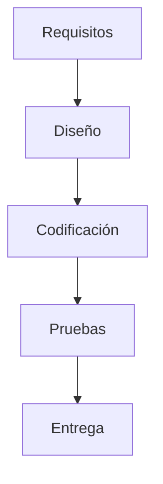
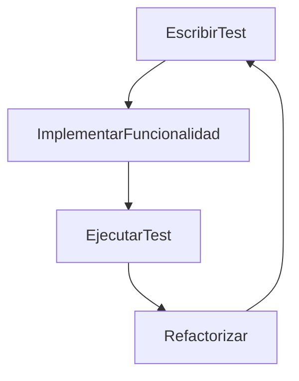
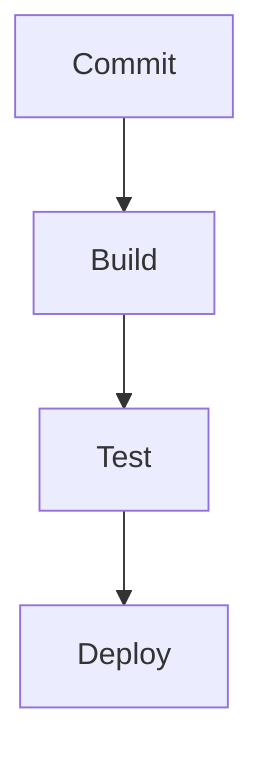

## TEMA 30 – PRUEBAS Y DOCUMENTACIÓN DEL SOFTWARE

## ÍNDICE

1. Introducción
2. Concepto y objetivos de las pruebas de software
3. Tipos de pruebas y su clasificación
4. Estrategias de pruebas y automatización
5. Integración de pruebas en entornos ágiles y CI/CD
6. Documentación del software: tipos y utilidad
7. Herramientas y estándares actuales
8. Aplicación en el contexto escolar y profesional
9. Conclusión
10. Bibliografía

---

### 1. INTRODUCCIÓN

La calidad del software depende no solo de un buen diseño, sino también de una correcta validación y documentación. Las **pruebas de software** permiten verificar que un sistema cumple sus requisitos funcionales y no funcionales, mientras que la **documentación** asegura su comprensión, mantenimiento y evolución.

En 2025, con entornos ágiles, despliegues continuos y software como servicio, las pruebas y la documentación se han integrado en ciclos iterativos y automatizados que acompañan el desarrollo desde el inicio. Esta integración favorece entregas continuas, mayor resiliencia de los sistemas y una comunicación efectiva entre desarrolladores, testers, usuarios y administradores.

---

### 2. CONCEPTO Y OBJETIVOS DE LAS PRUEBAS DE SOFTWARE

Las pruebas de software constituyen un conjunto de actividades cuyo objetivo es evaluar el comportamiento de una aplicación frente a sus requisitos definidos. A través de ellas, se detectan errores, se valida la funcionalidad esperada y se garantiza que el sistema pueda operar bajo condiciones normales y extremas.

**Objetivos principales:**

* Asegurar la conformidad del producto respecto a los requisitos definidos.
* Detectar y eliminar errores durante el ciclo de vida.
* Verificar la calidad del software en términos de fiabilidad, rendimiento, seguridad, usabilidad y mantenibilidad.
* Reducir riesgos operacionales en entornos reales de producción.

---

### 3. TIPOS DE PRUEBAS Y SU CLASIFICACIÓN

Las pruebas pueden clasificarse de acuerdo con su nivel de integración, su objetivo y su enfoque técnico. Esta clasificación permite una mejor planificación, cobertura de test y seguimiento del proceso de aseguramiento de calidad.

**Por nivel:**

* **Unitarias**: validan funciones o métodos aislados. Es la base del TDD.
* **Integración**: comprueban la interacción entre módulos o componentes.
* **Sistema**: evalúan la aplicación como un todo, incluyendo interfaces.
* **Aceptación**: pruebas funcionales con la participación del cliente o usuario.

**Por finalidad:**

* **Funcionales**: validan que el sistema haga lo que se espera.
* **No funcionales**: miden rendimiento, escalabilidad, accesibilidad, etc.
* **Regresión**: aseguran que nuevas funcionalidades no afecten las existentes.
* **Caja blanca**: se basan en el conocimiento interno del código.
* **Caja negra**: solo consideran entradas y salidas, sin ver el código.

#### Tabla resumen

| Tipo        | Enfoque          | Herramientas comunes  |
| ----------- | ---------------- | --------------------- |
| Unitaria    | Caja blanca      | JUnit, Pytest, NUnit  |
| Integración | Modular          | Postman, REST-assured |
| Sistema     | Funcional global | Selenium, Cypress     |
| Aceptación  | Cliente/Usuario  | Cucumber, Behave      |
| Rendimiento | No funcional     | JMeter, k6            |

---

### 4. ESTRATEGIAS DE PRUEBAS Y AUTOMATIZACIÓN

La estrategia de pruebas debe definirse en función del modelo de desarrollo, los objetivos de calidad y los recursos disponibles. Algunas prácticas modernas incluyen:

* **Pruebas dirigidas por requisitos**: cada test se traza a un requisito.
* **TDD (Test Driven Development)**: escribir pruebas antes de codificar permite diseñar soluciones más limpias y menos acopladas.
* **BDD (Behavior Driven Development)**: los tests se expresan en lenguaje natural comprensible para todas las partes.
* **Automatización de pruebas**: reduce tiempos y mejora la eficiencia del ciclo de vida.

**Ventajas de la automatización:**

* Reducción de errores humanos.
* Alta repetibilidad.
* Integración con pipelines de CI/CD.
* Feedback inmediato.

---

### 5. INTEGRACIÓN EN ENTORNOS ÁGILES Y CI/CD

Las metodologías ágiles como Scrum o Kanban integran las pruebas desde el principio del desarrollo. Cada sprint incluye definición de criterios de aceptación y pruebas automatizadas.

**CI/CD (Integración y entrega continua):**

* **CI**: tras cada commit, se ejecutan automáticamente las pruebas unitarias e integración.
* **CD**: si las pruebas pasan, se despliega a entornos de staging o producción automáticamente.

**Herramientas populares:** Jenkins, GitHub Actions, GitLab CI/CD, CircleCI.

---

### 6. DOCUMENTACIÓN DEL SOFTWARE: TIPOS Y UTILIDAD

La documentación es un artefacto clave que permite entender, usar, mantener y evolucionar un sistema. Puede generarse de forma paralela o automatizada.

#### Tipos principales:

* **Documentación técnica**: APIs, arquitecturas, flujos de trabajo.
* **Documentación de usuario**: manuales, guías interactivas, tutoriales.
* **Documentación de pruebas**: escenarios, plan de pruebas, resultados.
* **Documentación de mantenimiento**: procedimientos de backup, logs.
* **Documentación viva**: mantenida en repositorios, como Markdown o HTML.

#### Tabla resumen

| Tipo               | Destinatario     | Contenido                            |
| ------------------ | ---------------- | ------------------------------------ |
| Técnica            | Desarrolladores  | API, arquitectura, flujos, patrones  |
| De usuario         | Usuario final    | Manuales, ayuda, FAQs                |
| De pruebas         | QA/Testers       | Casos, criterios de aceptación       |
| De mantenimiento   | Soporte/Técnicos | Planes de recuperación, instalación  |
| Documentación viva | Equipos ágiles   | Wiki online, Markdown, auto-generada |

---

### 7. HERRAMIENTAS Y ESTÁNDARES ACTUALES

**Pruebas:**

* Unitarias: JUnit (Java), Pytest (Python), NUnit (C#).
* Integración: Postman, REST-assured.
* Funcionales/UI: Selenium, Cypress, Playwright.
* Carga y rendimiento: Apache JMeter, k6.

**Documentación:**

* Generadores automáticos: Sphinx (Python), MkDocs, Docusaurus, Swagger/OpenAPI.

**Estándares:**

* ISO/IEC/IEEE 29119: estándar para procesos de prueba.
* ISO/IEC 26514: documentación del usuario de software.
* IEEE 829: formato de informes de prueba.

**Tendencias:**

* Docs-as-code.
* Pruebas como microservicios.
* TestOps y observabilidad.

---

### 8. APLICACIÓN EN EL CONTEXTO ESCOLAR Y PROFESIONAL

**Contexto educativo (FP - ASIR, DAM, DAW):**

* Uso de Pytest, Selenium y GitHub Actions.
* Prácticas de TDD con repositorios compartidos.
* Documentación técnica de APIs REST con Swagger.

**Contexto profesional:**

* Cultura de calidad integrada (Quality Engineering).
* Pipelines CI/CD con pruebas y despliegues automáticos.
* Cumplimiento normativo en documentación y trazabilidad.

---

### 9. CONCLUSIÓN

Las pruebas y la documentación han evolucionado desde actividades finales del ciclo hasta convertirse en pilares continuos del desarrollo moderno. Las pruebas garantizan funcionalidad, robustez y fiabilidad, mientras que la documentación facilita el entendimiento, mantenimiento y colaboración.

Formar en estas áreas dota al alumnado de competencias fundamentales para el mercado actual, donde la automatización, la entrega continua y la documentación integrada forman parte del día a día de los equipos de desarrollo profesional.

---

### 10. BIBLIOGRAFÍA

* Myers, G. J., Sandler, C., Badgett, T. (2011). *The Art of Software Testing*.
* ISO/IEC/IEEE 29119 (Software Testing Standard).
* ISO/IEC 26514 (Software Documentation).
* Beck, K. (2003). *Test-Driven Development: By Example*.
* Atlassian, GitHub, Cypress, Selenium, Pytest docs.
* swagger.io, mkdocs.org, sphinx-doc.org
