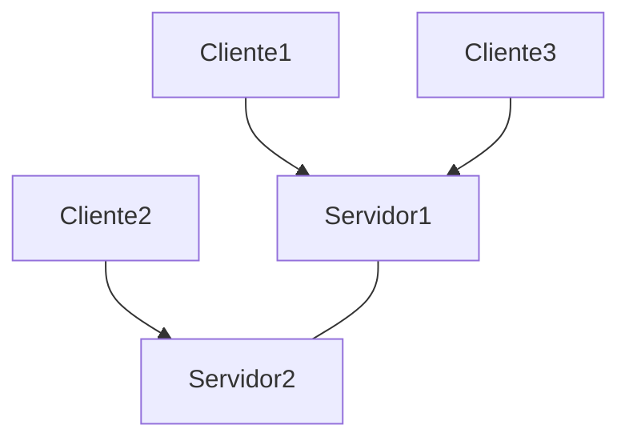
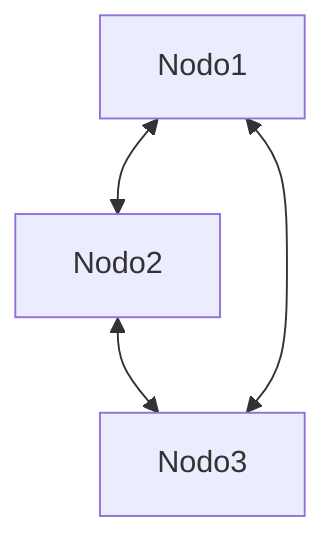
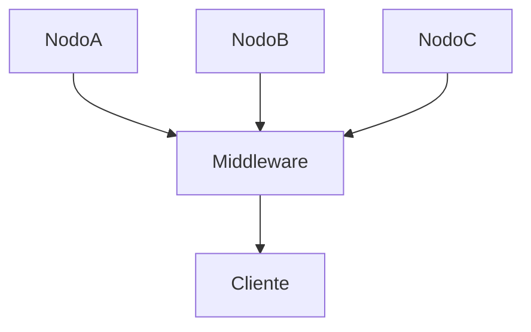
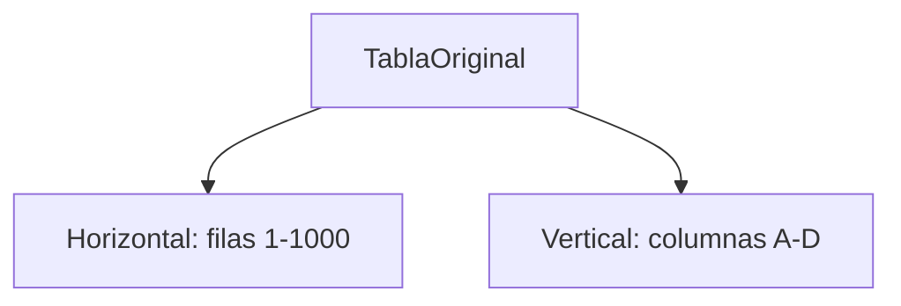
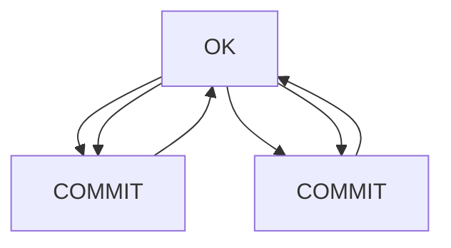
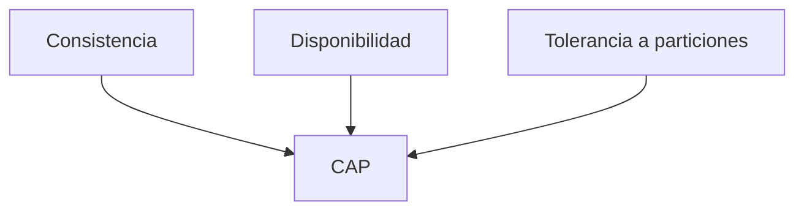

## TEMA 42 – SISTEMAS DE BASES DE DATOS DISTRIBUIDOS

## ÍNDICE

1. Introducción
2. Concepto, funciones y características de un sistema de base de datos distribuido
3. Arquitecturas y modelos de distribución de datos
4. Gestión de transacciones y consistencia en sistemas distribuidos
5. Tecnologías y tendencias actuales en bases de datos distribuidas
6. Aplicaciones prácticas y casos de uso reales
7. Aplicación de los contenidos al contexto escolar y laboral
8. Conclusión
9. Bibliografía

---

### 1. INTRODUCCIÓN

La transformación digital de las organizaciones ha supuesto una creciente necesidad de distribuir la información entre múltiples ubicaciones físicas. En este contexto, los Sistemas de Bases de Datos Distribuidos (SBDD) surgen como una solución para gestionar conjuntos de datos fragmentados, replicados y almacenados en nodos independientes, manteniendo una visión unificada y transparente para el usuario.

El concepto de SBDD es clave en entornos donde se requiere disponibilidad constante, tolerancia a fallos, rendimiento a escala global y gestión eficiente de recursos. Ejemplos de estas aplicaciones se encuentran en el comercio electrónico internacional, los sistemas bancarios, las plataformas educativas distribuidas y los entornos de computación en la nube.

Desde el punto de vista educativo, su enseñanza fortalece competencias en administración de bases de datos, redes de computadores, arquitectura de sistemas y diseño distribuido, presentes en módulos de ciclos formativos como ASIR, DAM o DAW.

---

### 2. CONCEPTO, FUNCIONES Y CARACTERÍSTICAS DE UN SISTEMA DE BASE DE DATOS DISTRIBUIDO

Un Sistema de Base de Datos Distribuido es aquel en el que los datos no están almacenados en una única ubicación física, sino que están distribuidos entre diferentes nodos de red, gestionados de forma coordinada por uno o más Sistemas Gestores de Bases de Datos (SGBD).

**Funciones clave de un SBDD:**

* Procesamiento de consultas distribuidas
* Gestión de transacciones en múltiples nodos
* Fragmentación lógica y física de datos
* Replicación para redundancia y rendimiento
* Coordinación de concurrencia y control de acceso
* Manejo de errores y recuperación ante fallos

**Características principales:**

* **Transparencia de acceso:** el usuario interactúa como si todo estuviera en un solo lugar.
* **Autonomía local:** cada nodo puede gestionar su propia porción de datos.
* **Redundancia controlada:** mediante replicación sincronizada o eventual.
* **Escalabilidad horizontal:** permite añadir nuevos nodos sin rediseñar el sistema.
* **Distribución geográfica:** mejora latencia y disponibilidad global.

#### Tabla: Diferencias entre BBDD Centralizada y Distribuida

| Característica      | BBDD Centralizada          | BBDD Distribuida                  |
| ------------------- | -------------------------- | --------------------------------- |
| Ubicación de datos  | Única                      | Múltiples nodos                   |
| Tolerancia a fallos | Limitada                   | Alta con replicación              |
| Escalabilidad       | Vertical                   | Horizontal                        |
| Latencia            | Mayor con usuarios remotos | Menor si nodos están distribuidos |

---

### 3. ARQUITECTURAS Y MODELOS DE DISTRIBUCIÓN DE DATOS

Los SBDD pueden adoptar diferentes arquitecturas, según el grado de acoplamiento, responsabilidad y colaboración entre nodos:

#### 3.1. Arquitectura Cliente-Servidor Distribuido

#### 3.2. Arquitectura Peer-to-Peer

#### 3.3. Arquitectura Federada

#### 3.4. Fragmentación de Datos

#### 3.5. Replicación

* **Síncrona:** garantiza consistencia fuerte.
* **Asíncrona:** mejora disponibilidad, puede tener retraso en la consistencia.

---

### 4. GESTIÓN DE TRANSACCIONES Y CONSISTENCIA EN SISTEMAS DISTRIBUIDOS

Una transacción distribuida afecta a múltiples nodos, lo que implica coordinar su ejecución para mantener las propiedades ACID (Atomicidad, Consistencia, Aislamiento, Durabilidad).

#### 4.1. Protocolo 2PC (Two-Phase Commit)

Alternativas como 3PC o algoritmos como **Raft** y **Paxos** se emplean para consensos tolerantes a fallos.

#### 4.2. Teorema CAP

---

### 5. TECNOLOGÍAS Y TENDENCIAS ACTUALES EN BASES DE DATOS DISTRIBUIDAS

| Tecnología     | Tipo       | Características clave                           |
| -------------- | ---------- | ----------------------------------------------- |
| PostgreSQL BDR | Relacional | Replicación bidireccional, ACID, SQL estándar   |
| MongoDB        | NoSQL      | Sharding, consultas JSON, consistencia eventual |
| Cassandra      | NoSQL      | Modelo P2P, escalabilidad lineal                |
| CockroachDB    | NewSQL     | ACID, auto-rebalanceo, tolerancia a fallos      |
| Google Spanner | NewSQL     | Relojes atómicos, replicación global            |
| BigchainDB     | Blockchain | Inmutabilidad, consenso distribuido             |
| IPFS + OrbitDB | P2P        | Bases descentralizadas sobre IPFS               |

**Tendencias en 2025:**

* Blockchain para trazabilidad de datos.
* Bases de datos serverless.
* Multimodelo: soporte JSON, SQL y documentos.
* Edge computing: bases distribuidas en el perímetro.

---

### 6. APLICACIONES PRÁCTICAS Y CASOS DE USO REALES

#### 6.1. Comercio electrónico global

Plataformas como Amazon utilizan replicación geográfica para garantizar respuesta rápida y disponibilidad.

#### 6.2. Sistemas bancarios

Los bancos distribuyen cuentas y operaciones por zonas, aplicando consistencia estricta mediante protocolos como 2PC o Raft.

#### 6.3. Sanidad y eSalud

Historias clínicas accesibles desde hospitales remotos, manteniendo coherencia e integridad de datos.

#### 6.4. Educación y teleformación

Repositorios académicos distribuidos, sincronizados entre centros para acceso offline o por zonas horarias.

#### 6.5. Microservicios y Big Data

Persistencia independiente por microservicio y uso de sistemas como Cassandra o Kafka como backends distribuidos.

#### 6.6. Blockchain educativo

Certificación y verificación descentralizada de títulos y matrículas mediante cadenas de bloques.

---

### 7. APLICACIÓN DE LOS CONTENIDOS AL CONTEXTO ESCOLAR Y LABORAL

#### Aplicación escolar (FP Grado Superior)

* Prácticas de fragmentación y replicación con PostgreSQL y MongoDB en entornos Docker
* Laboratorios con pruebas de consistencia ante fallos
* Diseño y despliegue de SBDD simulando nodos remotos
* Proyectos integrados: simulación de tienda online con SBDD
* Introducción a blockchain en el aula: emisión de diplomas digitales en red descentralizada

#### Aplicación profesional

* Diseño y mantenimiento de sistemas críticos (sanidad, banca, e-commerce)
* Trabajo en entornos de alta disponibilidad
* Especialización DevOps y backend distribuido
* Programación orientada a microservicios tolerantes a fallos
* Implantación de soluciones de trazabilidad y seguridad con blockchain

---

### 8. CONCLUSIÓN

Los sistemas de bases de datos distribuidos son fundamentales para abordar los retos de escalabilidad, disponibilidad y resiliencia que exige la era digital. Su implementación requiere una comprensión técnica sólida sobre arquitectura, protocolos de consenso, particionado de datos y control de concurrencia.

Su estudio capacita al alumnado para afrontar entornos reales de trabajo donde los datos deben estar disponibles globalmente, distribuidos de forma eficiente y protegidos contra fallos. El enfoque didáctico permite integrar conocimientos transversales y preparar a los estudiantes para desafíos técnicos avanzados en múltiples sectores, incluyendo aquellos potenciados por blockchain y descentralización.

---

### 9. BIBLIOGRAFÍA

* Özsu, M. T., & Valduriez, P. (2020). *Principles of Distributed Database Systems*. Springer.
* García-Molina, H., Ullman, J. D., & Widom, J. (2008). *Database Systems: The Complete Book*.
* Coronel, C., & Morris, S. (2021). *Database Systems: Design, Implementation, and Management*.
* Date, C. J. (2004). *Introducción a los sistemas de bases de datos*. Pearson.
* Documentación oficial de PostgreSQL, MongoDB, Cassandra, CockroachDB, Google Spanner.
* BigchainDB, IPFS y OrbitDB.
* Recursos técnicos: cloud.google.com/spanner, docs.cockroachlabs.com, mongodb.com/docs

---

