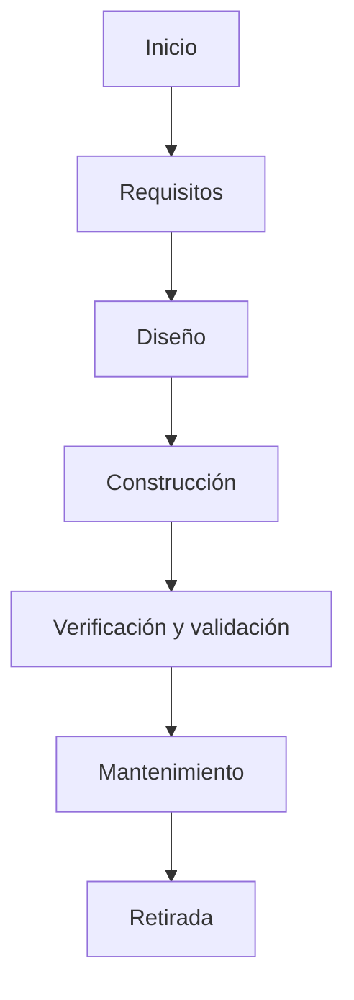
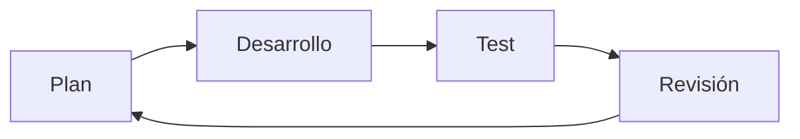
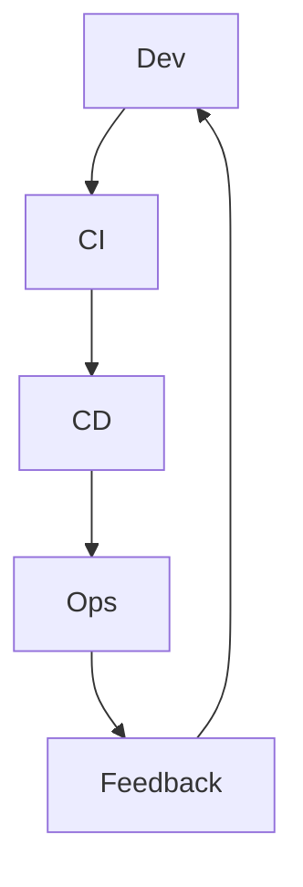

## TEMA 48 – INGENIERÍA DEL SOFTWARE. CICLO DE DESARROLLO DEL SOFTWARE. METODOLOGÍAS ACTUALES EN LA UE

## ÍNDICE

1. Introducción
2. Ingeniería del Software: concepto, objetivos y enfoque actual
3. El ciclo de vida del software: fases y procesos
4. Modelos clásicos de ciclo de vida: cascada, espiral, iterativo incremental
5. Metodologías ágiles: Scrum, Kanban, XP
6. DevOps, DevSecOps y enfoques CI/CD
7. Metodologías híbridas y normativas europeas
8. Aplicación en el contexto escolar y profesional
9. Conclusión
10. Bibliografía

---

### 1. INTRODUCCIÓN

El desarrollo de software es una disciplina clave en la sociedad digital actual. Desde sistemas críticos hasta aplicaciones móviles, todo software pasa por un proceso estructurado de desarrollo, conocido como **ciclo de vida del software**. La Ingeniería del Software, como disciplina formalizada, establece métodos, modelos y herramientas que permiten garantizar la calidad, mantenibilidad y evolución de los sistemas informáticos.

En la actualidad, el enfoque ha evolucionado desde los modelos secuenciales rígidos hacia metodologías ágiles, centradas en la entrega rápida de valor, la colaboración y la adaptabilidad. Además, el auge de la automatización, la integración continua y la entrega continua (CI/CD), así como la incorporación de principios de seguridad desde el diseño (DevSecOps), han transformado radicalmente el ciclo de desarrollo.

---

### 2. INGENIERÍA DEL SOFTWARE: CONCEPTO, OBJETIVOS Y ENFOQUE ACTUAL

La Ingeniería del Software es el conjunto de principios, métodos y herramientas orientados al diseño, desarrollo, mantenimiento y gestión de sistemas de software complejos, garantizando calidad, eficiencia y sostenibilidad.

**Objetivos principales:**

* Reducir costes y riesgos.
* Aumentar la fiabilidad y mantenibilidad.
* Mejorar la planificación y la gestión de proyectos.
* Fomentar la reutilización y la escalabilidad.

**Áreas clave:**

* Requisitos, arquitectura, diseño, pruebas, mantenimiento, gestión de configuración y calidad.

---

### 3. EL CICLO DE VIDA DEL SOFTWARE: FASES Y PROCESOS

El ciclo de vida del software describe las fases por las que pasa un sistema desde su concepción hasta su retirada. Según el estándar ISO/IEC 12207, las fases son:

Cada fase se apoya en procesos de gestión, soporte y reutilización. El ciclo puede ser secuencial, iterativo o incremental según la metodología adoptada.

---

### 4. MODELOS CLÁSICOS DE CICLO DE VIDA

| Modelo      | Características                 | Limitaciones                          |
| ----------- | ------------------------------- | ------------------------------------- |
| Cascada     | Secuencial, controlado          | Poco flexible ante cambios            |
| Espiral     | Basado en riesgos y prototipos  | Complejo, costoso                     |
| Incremental | Entrega progresiva de versiones | Difícil de planificar módulos futuros |

**Cascada:** sigue el orden lineal de fases, útil en entornos con requisitos estables.
**Espiral:** combina desarrollo iterativo y gestión de riesgos.
**Iterativo incremental:** permite entregar valor parcial desde etapas tempranas.

---

### 5. METODOLOGÍAS ÁGILES: SCRUM, KANBAN, XP

Desde 2001, con el Manifiesto Ágil, el foco se desplaza hacia la adaptabilidad y la entrega temprana de valor.

#### Scrum

* Roles: Product Owner, Scrum Master, equipo de desarrollo.
* Artefactos: backlog, sprint backlog, incrementos.
* Eventos: sprint, daily, review, retrospective.

#### Kanban

* Flujo visual de tareas.
* Límite de trabajo en curso (WIP).
* Mejora continua (kaizen).

#### Extreme Programming (XP)

* Desarrollo dirigido por pruebas (TDD).
* Integración continua.
* Programación en pareja.

---

### 6. DEVOPS, DEVSECOPS Y ENFOQUES CI/CD

**DevOps** une desarrollo y operaciones para acelerar la entrega con alta calidad.
**DevSecOps** incorpora seguridad desde el inicio.

| Enfoque   | Características clave                             |
| --------- | ------------------------------------------------- |
| DevOps    | Automatización, colaboración, entrega continua    |
| CI/CD     | Integración, pruebas y despliegues automatizados  |
| DevSecOps | Integración de seguridad en todo el ciclo de vida |

Herramientas comunes: GitHub Actions, Jenkins, Docker, Kubernetes, SonarQube.

---

### 7. METODOLOGÍAS HÍBRIDAS Y NORMATIVAS EUROPEAS

**Híbridas:** combinan enfoques predictivos y ágiles. Ejemplo: Scrumban, PRINCE2 Agile.

**Normas europeas y marcos de referencia:**

* ISO/IEC 29110 (microempresas)
* ISO/IEC 12207 (ciclo de vida del software)
* European eGovernment Interoperability Framework (EIF)

Tendencias UE:

* Contratación pública basada en metodologías ágiles.
* Seguridad por diseño.
* Interoperabilidad abierta.

---

### 8. APLICACIÓN EN EL CONTEXTO ESCOLAR Y PROFESIONAL

**En el aula:**

* Proyectos integrados con Scrum y Git.
* Simulación de procesos de entrega con GitHub y CI/CD.
* Enseñanza de DevSecOps mediante pipelines sencillos.

**En el entorno laboral:**

* Desarrollo de software ágil en equipos multidisciplinares.
* Uso de herramientas de entrega automatizada.
* Adopción de metodologías híbridas en entornos regulados.

---

### 9. CONCLUSIÓN

La Ingeniería del Software proporciona las bases para construir soluciones digitales sostenibles, eficientes y seguras. Con el auge de metodologías ágiles, la automatización CI/CD y el enfoque DevSecOps, el ciclo de vida del software se ha transformado en un proceso continuo y adaptativo. La enseñanza de estos modelos es esencial para formar profesionales capaces de trabajar en entornos reales y exigentes, alineados con las directrices de calidad e interoperabilidad marcadas en la Unión Europea.

---

### 10. BIBLIOGRAFÍA

* Sommerville, I. (2020). *Ingeniería del Software* (10ª ed.). Pearson.
* Pressman, R. S. (2015). *Software Engineering: A Practitioner’s Approach*.
* Manifiesto Ágil. agilemanifesto.org
* ISO/IEC 12207, ISO/IEC 29110
* European Commission. *Interoperability Framework (EIF)*.
* Documentación de Atlassian (Scrum, Kanban), GitHub Actions, Docker, Jenkins.
